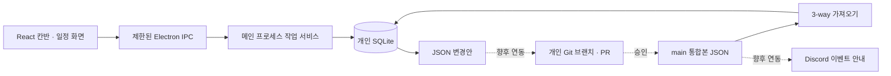

# 이음 기본 구조



## 소스 위치

| 파일 | 역할 |
| --- | --- |
| src/App.tsx | 칸반·일정·변경·연결 화면 및 작업 입력 |
| src/types.ts | 화면과 IPC 사이의 데이터 형식 |
| electron/preload.cjs | renderer에 허용된 API만 노출 |
| electron/main.cjs | 창 생성, IPC, JSON 파일 선택·저장 |
| electron/store.cjs | DB, 상태 전환, 변경안 생성, 통합 충돌 확인 |

renderer는 Node와 파일 시스템에 직접 접근하지 않습니다. context isolation, sandbox, CSP를 적용하며 외부 탐색과 새 창을 차단합니다. 검토자/작업자 확인과 입력 검증은 SQLite를 쓰는 서비스에서 다시 수행합니다. 현재 테스트 사용자 선택은 체험용이며 실제 신원 확인을 대신하지 않습니다.

## 로컬 데이터

- tasks: 작업 UUID, 내용, 담당 파트, 원 작업자, 검토자, 상태, 우선순위, 지정일·마감일·완료일, 설명, 재작업 사유, 버전.
- baseline_tasks: 마지막으로 받은 통합본. 개인 변경을 비교하는 기준.
- metadata: 프로젝트 ID, 기준 revision, 테스트 사용자.
- activity: 작업 변경 기록.
- notification_outbox: 알림 이벤트 미리보기. 외부 전송기는 아직 없음.

작업과 활동·이벤트는 같은 트랜잭션에 저장합니다. 이전 버전으로 수정하려 하면 거부하여 화면의 오래된 내용으로 덮어쓰지 못하게 합니다. 신규 작업 ID는 UUID를 사용합니다. 재작업 사유는 이력을 위해 완료 후에도 보존됩니다.

## 상태 전환

| 출발 | 도착 | 처리자 |
| --- | --- | --- |
| 할 일 / 재작업 | 진행 중 | 원 작업자 또는 PD / PM |
| 진행 중 | 검토 | 원 작업자 또는 PD / PM |
| 검토 | 재작업 | 검토자 또는 PD / PM, 사유 필수 |
| 검토 | 완료 | 검토자 또는 PD / PM, 완료일 자동 기록 |

검토 요청은 같은 작업의 현재 처리자를 검토자로 바꿉니다. 중복 작업을 만들지 않습니다. 후속 제작 파트에 새 작업을 생성하는 기능은 향후 구현할 별도 규칙입니다.

## 파일 형식과 통합

내보낸 변경안은 `schemaVersion`, `projectId`, `baseRevision`, `authorId`, `changes`를 포함합니다. 각 changes 항목은 작업 ID, 변경 전 base, 변경 후 task, 바뀐 fields를 포함합니다. 이 파일을 앱에 그대로 가져오는 것이 아니라, 향후 PR 검증기가 승인된 변경으로 통합본을 만듭니다.

가져올 통합본:

```json
{
  "schemaVersion": 1,
  "projectId": "ieum-demo",
  "revision": "main-commit-sha-or-demo-revision",
  "tasks": []
}
```

`tasks`에는 승인된 전체 작업을 넣습니다. 작업 구조는 src/types.ts의 Task를 따릅니다. 예시 전체 파일은 examples/demo-snapshot.json입니다. 이 프로토타입은 삭제 병합을 지원하지 않으므로 기존 통합본의 작업이 빠져 있으면 반영을 거부합니다.

가져오기는 기준본(base), 개인본(local), 통합본(remote)의 같은 필드를 비교합니다. 한쪽만 바뀌면 그 변경을 적용하고, 양쪽이 같은 값으로 바뀌어도 적용합니다. 서로 다른 값으로 바뀌거나 합친 날짜·상태 관계가 유효하지 않으면 전체 반영을 멈춥니다. 충돌 없는 가져오기는 개인 변경을 남기고 baseline을 새 통합본으로 교체합니다. 임의의 revision 문자열은 현재 파일 형식 검증용이며 실제 Git 커밋 인증이나 승인 증명이 아닙니다.

## 다음 구현 경계

GitHub 인증·개인 브랜치·PR 작성·CI 검증, 프로젝트/사용자 설정, 충돌 해결 UI, 삭제 정책, 후속 작업 생성, Discord 전송기를 순서대로 추가합니다. AI는 변경 해석과 충돌 해결안 제시에 사용할 수 있으나 동일 항목의 충돌을 자동으로 임의 확정하지 않습니다. Discord는 main 통합 후 이벤트 ID를 기준으로 한 번 전송하며, 봇 버튼을 통한 상태 변경도 원래의 권한·전환 규칙을 따르도록 설계합니다. 서버 없이 즉시 전송을 보장하려면 실행 주체(예: GitHub Actions)의 가용성과 비용·토큰 관리가 추가로 검토되어야 합니다.
