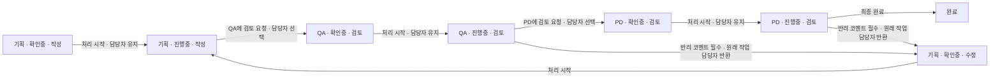
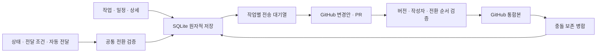

# Jira를 참고한 IEUM 작업 워크플로 재설계

> 후속 변경: [상태와 담당자 전달 분리](collaborative-handoff-plan.md)가 아래의 담당자 기반 편집 잠금과 전달 시 확인중 초기화를 대체한다. 현재 앱은 미완료 작업을 공동 편집하고, 직접 전달은 상태를 유지하며 직전 전달자를 기록한다. 아래 내용은 이전 설계 경과다.

## 범위와 기존 구조

이번 개편은 프로젝트 작업, 상태, 파트별 전달, 참여자 관리 권한을 대상으로 한다. 일정·연결 탭, 알림의 분할 화면, 프로젝트 사이드바와 기존 데이터는 이어서 사용한다.

기존 구현은 시트에 여러 카드를 배치할 수 있었지만 실제 실행은 `review`와 `done`이라는 상태 ID에 묶여 있었다. 검토 후 승인 대상을 완료로 제한하고, 완료 상태에서 출발하거나 같은 상태에서 담당자만 변경하는 연결을 금지했다. 단계 목록은 즉시 저장되는 반면 연결 시트는 별도로 저장되어 편집 중인 흐름의 일부만 작업에 적용될 수 있었다.

Jira의 [상태와 전환](https://support.atlassian.com/jira-software-cloud/docs/what-are-jira-workflows/), [실행 조건·입력 검증·전환 후 처리의 구분](https://support.atlassian.com/jira-software-cloud/docs/what-are-the-different-workflow-rule-types/)을 참고했다. IEUM의 파트 전달과 ‘특정 파트 경로가 전체 경로보다 우선’하는 규칙은 유지한다.

## 새 도메인 구조

| 구성 | 저장 항목 | 실제 역할 |
| --- | --- | --- |
| 상태 | ID, 이름, 3열 범주, 편집 정책, 시작 여부 | 현재 담당자의 확인중·진행중·완료 상황 |
| 전환 | ID, 출발·도착 상태, 버튼 이름, 동작 | 사용자가 실행할 구체적인 처리 |
| 처리 목적 | 작성, 검토, 수정 | 같은 확인중·진행중 안에서 무엇을 처리해야 하는지 표시 |
| 실행 조건 | 전달 파트, 현재 처리 대상, 활성 참여자, 현재 목적 | 현재 사용자에게 전환 버튼을 표시할지 결정 |
| 입력 검증 | 필수 코멘트, 설명, 마감일 | 버튼 실행 때 누락된 입력을 검사하고 전체 전환을 중단 |
| 전환 후 처리 | 전달 시 선택, 지정 파트·작업자, 현재 대상 유지, 작업 담당자 반환, 실행자 배정, 다음 목적 | 상태 변경과 함께 다음 처리 대상을 결정 |
| 시트 배치 | 카드 좌표, 전달조건 라벨 오프셋 | 다이어그램 표현과 편집 위치 |

칸반은 확인중·진행중·완료 3열을 사용한다. 신규 프로젝트의 상태도 `todo`·`doing`·`done` 3개다. 검토와 반려는 별도 열 대신 담당자 변경과 처리 목적을 가진 전달 동작으로 표현한다. 완료 여부는 도착 상태의 범주가 결정하며, 기획자가 작성을 끝낸 뒤 검토를 넘기는 행위는 전체 작업 완료가 아니다.

기존 사용자 정의 상태와 전환은 삭제하지 않는다. 추가 상태는 지정한 범주의 열에 묶으며 상세에서 원래 세부 상태를 확인할 수 있다. 범주가 명시되지 않은 예전 `review`와 `rework`는 확인중 열에 표시하고 기존 실제 상태·전달 조건은 보존한다. 상태 목록의 정렬은 설정과 시트의 순서이며 고정된 칸반 3열의 순서를 바꾸지 않는다.

`WorkTask.workflowPurpose`는 전달 후 작성·검토·수정 목적을 보존한다. `WorkflowSheetRoute.purpose`는 다음 목적을 설정하며 빈 값이면 유지한다. `requiredPurpose`는 특정 처리 목적에서만 버튼을 허용한다. 예전 데이터에 목적이 없으면 검토 상태나 반려 경로에서 호환 목적으로 도출한다.

편집 정책은 현재 처리 담당자·모든 참여자·수정 잠금 중에서 선택한다. 완료 상태는 본문을 잠근다. 프로젝트 관리자는 잠기지 않은 상태의 작업을 편집하고, 필요하면 기존 관리자 회수로 작업과 담당자를 복구할 수 있다. 단계와 전환 정의를 게시하는 기능은 프로젝트 소유자가 관리한다. 작업 등록·진행·삭제·검토에는 별도의 기능 권한을 되살리지 않는다. 참여자·파트 관리 권한은 기존의 최소 관리 설정을 사용한다.

새 작업의 시작 상태를 명시적으로 하나 지정할 수 있다. 이전 설정에 명시된 시작 상태가 없으면 첫 번째 편집 가능한 미완료 상태를 사용한다. 시작 상태를 명시한 뒤에는 목록 순서를 바꾸어도 신규 작업의 시작 위치가 바뀌지 않는다.

## 기획 → QA → PD 예시

이 흐름은 같은 3상태에서 담당자와 목적만 바꾸는 예시다. 신규 기본 경로는 확인중 → 진행중의 `start`(담당자 유지), 진행중 → 확인중의 `handoff`(전달할 때 선택·검토), 진행중 → 완료의 `finish`(최종 완료), 검토 목적의 진행중 → 확인중 `return`(반려 코멘트 필수·원래 작업 담당자 반환·수정 요청)이다. 기존 프로젝트의 규칙을 자동으로 이 예시로 덮어쓰지 않는다.

`assignment: select`의 전달 확인창은 허용된 파트·담당자를 사용자가 선택하고 선택 결과를 최신 작업·규칙과 함께 다시 검증한다. 지정된 받는 파트가 있으면 그 범위만 선택할 수 있다. 여러 QA 담당자에게 공동 처리 권한을 주려면 QA 전체를 선택하고, 한 명에게만 맡기려면 해당 작업자를 선택한다. 내 할 일은 현재 사용자나 소속 파트가 실제 처리 대상으로 배정된 미완료 작업이며, 일반적인 편집 권한이나 전체 경로 실행 가능 여부만으로 포함하지 않는다.

같은 상태로 연결하여 담당자만 바꾸거나 자기 자신에게 배정할 수 있다. 완료에서 진행 중 상태로 이어지는 명시적 재개 연결도 설정할 수 있다. 연결이 없으면 해당 버튼이 생기지 않는다.

동일 동작에서 사용자의 파트에 해당하는 구체적인 경로가 있으면 모든 작업자 경로는 제외한다. 해당 구체적 경로의 수신자가 사라져도 전체 경로로 우회하지 않는다. 여러 파트에 속한 사용자는 일치하는 구체적인 경로를 각각 선택할 수 있다. 서로 다른 동작인 승인과 반려는 별도로 우선순위를 계산한다.

## 화면과 저장 흐름

프로젝트 설정의 작업 단계 화면은 왼쪽 50%에 상태 목록, 오른쪽 50%에 전환 시트를 둔다. 상태의 추가·수정·삭제·정렬과 카드·연결·라벨 편집이 하나의 초안에 반영된다. 초안은 프로젝트별 로컬 metadata에 자동 저장되어 화면을 나갔다 돌아와도 복원된다.

‘3단계 기본 흐름’은 확인을 거쳐 로컬 초안만 다시 구성한다. 원격 프로젝트나 기존 작업을 즉시 변경하지 않으며, 기존 검토·추가 상태에서 처리 중인 작업이 있으면 게시를 차단한다. 해당 작업을 명시적인 경로나 관리자 회수로 정리한 뒤 게시할 수 있다.

새 프로젝트는 이 3상태 기본 흐름으로 생성된다. 기존 공유 프로젝트는 보드만 3열로 바뀌고 4상태 정의·기획 → PD 같은 팀별 규칙은 유지된다. 새 기본 전달 동작을 적용하려면 초안을 구성하고 게시해야 한다. 작업 목록의 상태는 3열 이름으로 표시하며 현재 파트·처리자·목적은 현재 처리자 한 칸의 두 줄에 배치한다.

‘게시 · 적용’은 상태와 연결을 동일한 프로젝트 manifest SHA에 한 번에 저장한다. 다른 사용자가 상태나 시트를 변경했다면 이전 초안을 조용히 덮어쓰지 않고 충돌을 표시한다. 통합 작업이나 열린 변경 요청에서 사용하는 상태는 삭제할 수 없으며, 완료 분류 변경도 먼저 작업을 옮겨야 한다. 원격 검사를 할 수 없으면 해당 변경을 게시하지 않는다.

작업 화면의 전환 버튼은 현재 사용자의 실행 조건을 만족하는 연결에서 생성한다. 최종 확인창에서 목적 상태, 다음 처리 대상, 전환 뒤 편집 가능 여부와 코멘트를 확인한다. 필수 설명·마감일·코멘트가 없으면 작업 상태·담당자·활동 기록을 부분적으로 저장하지 않는다. 확인창을 연 뒤 작업 버전, 참여자 배정, 상태 정책 또는 전환 규칙이 바뀌면 다시 확인해야 한다. 카드나 라벨의 위치 변경만으로는 전달 확인이 무효가 되지 않는다.

원격 작업을 가져올 때 상태·현재 처리 대상·처리 목적·전환 ID·완료일·코멘트를 하나의 변경으로 병합한다. 서로 다른 두 전달의 상태와 담당자를 섞어서 만들지 않으며 충돌은 양쪽 내용을 보존해 표시한다.

제출되지 않은 로컬 변경은 작업별 중간 버전을 저장한다. 제출 JSON의 선택 항목 `steps`에 같은 작성자의 실제 저장·전환 순서를 담고, 업로드와 PR 통합은 시작 버전부터 최종 버전까지 각각 검증한다. 필수 설명을 채워 전달한 후 편집 가능한 상태에서 설명을 지운 정상 흐름도 검증할 수 있다. 버전 누락, 다른 작업 ID, 작성자가 실행할 수 없는 전환, 잠금 이후 편집은 거부한다. 중간 버전이 없는 이전 변경안은 기존의 최종 스냅샷 경로 검증을 계속 사용한다.

## 코드 연결

1.0.0 작업 공간은 하나의 작업 저장소를 여러 화면으로 보여준다. 작업 목록·칸반과 달력·타임라인은 같은 작업 ID와 날짜를 사용하며 별도 일정 사본을 생성하지 않는다. 연결 화면은 실제 전송 대기열과 통합·충돌 상태를 보여주며 설정으로 이어진다. 보관은 동기화되는 작업 속성으로 처리하고 복원 시 기존 내용과 상태를 유지한다.

`trigger: onEnter`는 사용자가 켠 경로에만 적용한다. `WorkflowAutomationRunner`는 실행 이후 새로 기록한 로컬 등록·상태 변경 이벤트를 ID·버전·상태·작성자로 확인한 뒤 공통 엔진을 호출한다. 기존 프로젝트를 열거나 원격 작업을 수신하거나 본문만 수정했을 때에는 실행하지 않는다. 현재 실행자의 파트·처리 목적 조건으로 가능한 경로가 정확히 하나이고 필수 입력이 충족되어야 전달한다. 담당 파트가 바뀌어 다음 처리 권한이 없어지면 해당 담당자의 행동을 기다린다. 전달 시 담당자 선택, 코멘트 입력, 복수 경로, 한 실행에서 이미 지난 상태로 돌아오는 경로, 연속 8회 이후는 수동 확인을 기다린다. 별도 서버의 예약 실행 기능은 아니다.

목록은 50개씩 표시하고 칸반은 열당 50개 이후 전체 목록으로 연결한다. 일정 달력은 최대 42개 날짜 셀, 타임라인은 현재 월 범위와 지연 생성 행을 사용한다. 좁은 작업 단계 설정은 상태/흐름 탭으로 전환하며 넓은 화면의 50:50 구성을 유지한다. 이 화면 전환은 테스트용 작업이나 이벤트를 저장하지 않는다.

로컬 활동 기록은 통합이 확인된 작업별 최근 100개를 유지하고 미전송 변경·증명·충돌 백업은 보존한다. 읽은 알림은 계정별 500개, 화면은 안읽음 우선 최대 500개를 선택한다. GitHub 파싱 캐시는 추정 비용 8MiB와 최신 스냅샷 1개로 제한한다. 1MiB를 넘는 전송에서 중간 증명을 생략하는 것은 최종 스냅샷만으로 독립 검증에 성공하는 경우뿐이다. 그렇지 않으면 로컬 데이터를 보존한 채 명확한 전송 보류 오류를 보여준다.

이전 1.0.0 기반의 2026-10-08 로컬 검증: 정적 분석 오류 없음, 자동 검사 434개 통과, 수동 UI 갤러리 1개 제외. Windows Release는 Visual Studio 2026 CMake 경로로 빌드했다. 배포 빌드 `20261008-011136`의 EXE·ZIP·SHA256을 생성하고 패키지에서 첫 프레임 시작 신호와 정상 실행 프로세스를 확인했다. 이 기록은 이번 3열·담당자 전달 변경의 검증 결과를 의미하지 않는다. 실제 프로젝트의 조작·팀 간 전송 수용 검증 및 GitHub 공개 배포는 수행하지 않았다.

- `models.dart`: 상태 속성, 프로젝트 시작·완료·잠금 규칙, 기존 작업 데이터 형식.
- `workflow_sheet_model.dart`: 전환 조건·입력 검증·배정 동작과 다이어그램 배치 저장.
- `workflow_engine.dart`: 버튼 조건, 파트 경로 우선순위, 입력 검증, 배정 계산, 변경 검증. SQLite 저장·GitHub 업로드·PR 통합이 같은 규칙을 사용한다.
- `store.dart`: 작업 생성, 최종 전달 확인, 원자적 전환, 최신 상태 기반 편집 제한·알림·병합.
- `workflow_definition_editor.dart`: 상태와 시트의 통합 초안 및 원자적 게시.
- `workflow_panel.dart`, `workflow_sheet_handoff.dart`, `workflow_sheet_canvas.dart`: 상태 속성, 전환 설정, 카드와 라벨 편집.
- `project_service.dart`, `github_sync.dart`: 게시의 기존 버전 비교, 사용 중 상태 검사, 원격 프로젝트 저장.

## 호환과 제한

기존 상태·카드·전환 ID, 파트 ID, 작업, 참여자, 위치를 보존한다. 추가 속성이 없는 상태와 전환은 이전 기본값으로 해석한다. 시트 형식은 버전 1과 2를 읽고 새 저장은 버전 2를 사용한다. 프로젝트·작업·제안의 외부 JSON 버전과 SQLite 작업 테이블은 그대로 사용한다. 제안에 선택적 변경 순서를 추가하고 로컬 보조 테이블을 생성하며 파괴적인 DB 마이그레이션은 없다.

GitHub 저장소와 SQLite 기반 동기화는 유지한다. 이 개편에서 Jira의 서버, 스프린트, 에픽, 다수의 승인자 투표, 임의의 스크립트 실행이나 팀 전체의 전환 이벤트 이력을 추가하지 않는다. 활동 기록은 기존 로컬 기록이다. 원격 제안은 최종 작업과 제출 전의 검증용 변경 순서를 공유하며, 팀 전체 이력 저장소를 추가하지 않는다. 업로드되지 않은 다른 컴퓨터의 초안은 원격 상태 사용 검사로 알아낼 수 없어 삭제된 단계 표시와 관리자 회수도 유지한다.

## 검증

검증은 코드 분석, 모델·저장소·UI 위젯·fake GitHub 업로드/PR 통합 테스트, Windows Release 빌드로 진행한다. 실제 계정의 프로젝트 규칙 게시와 실사용 UI 검증은 사용자가 진행한다.

이번 3열·담당자 전달 변경은 2026-10-08 관련 회귀 검사 55개와 최종 정적 분석을 통과했다. Windows Release 빌드와 `20261008-015146` portable 패키징을 완료하고, 최신 1.0.0 앱의 응답 상태와 정상 시작 기록의 경로를 확인했다. 기존 실제 프로젝트의 단계·전달 규칙은 게시하지 않았으며 실제 화면 조작과 팀 전달 흐름 검증은 수행하지 않았다. 아래는 이전 워크플로 기반의 빌드·검증 기록이다.

- 전체 테스트: 418개 통과, 기존 시각 갤러리 1개 건너뜀. 로그 `../../.local/jira-workflow-full-tests.log`.
- 전체 실행 중 추가된 업로드 후 변경 순서 변조 회귀: 별도 실행 1개 통과. 로그 `../../.local/jira-workflow-proof-integration-test.log`.
- `flutter analyze`: `No issues found`; `git diff --check` 통과.
- Windows Release: 설치된 Visual Studio 2026 CMake 경로로 빌드 성공. 실행 파일 `../build/windows/jira-workflow-check/runner/Release/ieum_flutter.exe`.
- 이전 앱을 정상 종료하고 새 실행 파일을 실행함. 프로세스 경로 확인까지 완료했으며 UI의 실제 클릭·드래그와 원격 규칙 게시를 대신 검증하지 않음.
